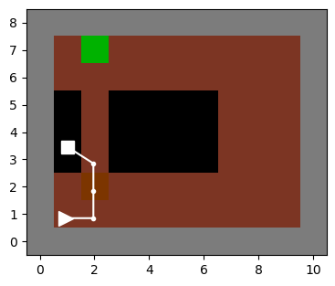
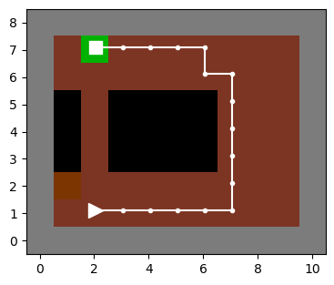

# Robust Meta Reinforcement Learning (RoML)

The paper [**Train Hard, Fight Easy: Robust Meta Reinforcement Learning**](https://arxiv.org/abs/2301.11147) introduces RoML - a meta-algorithm that takes any meta-learning baseline algorithm and generates a robust version of it.
This repo implements RoML on top of the [original implementation](https://github.com/lmzintgraf/varibad) of [VariBAD](https://arxiv.org/abs/1910.08348).
**See [below](#how-to-use-roml-with-another-meta-rl-baseline-(instead-of-varibad)) how to run RoML in your own favorite algorithmic framework with a few simple steps.**
Other implementation examples of RoML are on top of [PEARL](https://github.com/ido90/RoML-pearl) and [MAML](https://github.com/ido90/RoML-maml).

- [RoML](#what-is-roml)
- [How to reproduce our experiments](#how-to-reproduce-the-experiments-of-the-paper)
- [How to use RoML in your own framework](#how-to-use-roml-with-another-meta-rl-baseline--instead-of-varibad)

## What is RoML
* **Reinforcement Learning (RL)** aims to learn a policy that makes decisions and maximizes the cumulative rewards (AKA returns) within a given environment.
* **Meta-RL** aims to learn a "meta-policy" that can adapt quickly to new environments (AKA tasks).
* **Robust Meta RL (RoML)** is a meta-algorithm that takes a meta-RL baseline algorithm, and generates a robust version of this baseline.

#### Robustness in what sense?
RoML optimizes the returns of the high-risk tasks instead of the average task.
Specifically, it focuses on the $\alpha$% lowest-return tasks in the task-space, where the robustness level $\alpha\in[0,1]$ is controlled by the user.
Formally, this objective is defined as the [Conditional Value at Risk](https://en.wikipedia.org/wiki/Expected_shortfall) (CVaR) of the returns over the tasks.

#### How does RoML work?
During meta-training, RoML uses the [Cross Entropy Method](http://web.mit.edu/6.454/www/www_fall_2003/gew/CEtutorial.pdf) (CEM) to modify the selection of tasks, aiming to sample tasks whose expected return is among the worst $\alpha$%.

|   |
| :--: |
| A sample of test tasks in HalfCheetah (left) and Humanoid (right). In both examples, the task corresponds to high body mass, which is difficult to control and typically leads to lower scores. Within each figure, the right meta-agent was trained by RoML and the left one by the baseline VariBAD. In both environments, **RoML learned to handle the high mass by leaning forward and letting gravity do the hard work, leading to higher velocities than VariBAD**. |

|   |
| :--: |
| In the bridge environment of [Khazad-Dum](https://tolkiengateway.net/wiki/Bridge_of_Khazad-d%C3%BBm), VariBAD (left) attempts to take the short path through the bridge, but sometimes falls to the abyss. RoML (right) goes around and avoids the falling risk. |

## How to reproduce the experiments of the paper

To train the meta-policies, download this repo and run:

`python main.py --env-type ENV --seed 0 1 2 3 4`
* Replace `ENV` with the desired environment: `khazad_dum_varibad`, `cheetah_vel_varibad`, `cheetah_mass_varibad`, `cheetah_body_varibad` or `humanoid_mass_varibad`.
* The line above runs the baseline VariBAD algorithm. For RoML add `--cem 1`. For CVaR-ML (defined in the paper) add `--tail 1` (without `--cem`).
* To reproduce the full experiments of the paper, add seeds up to 29.

To process the results after training, use the module `analysis.py` as demonstrated in the notebooks in this repo (`.ipynb` files).

## How to use RoML in your own framework - on top of your own meta-RL baseline

RoML can be easily implemented on top of any meta-RL baseline algorithm (instead of VariBAD).
To run RoML in your own algorithmic framework, just **modify the process of task selection during meta-training**:
1. Create a CEM sampler before training (e.g., using the [Dynamic CEM package](https://pypi.org/project/cross-entropy-method/)).
2. When choosing the tasks, use the CEM to do the sampling.
3. After running the tasks, update the CEM with the resulted returns.

**For example, search "cem" in the module `metalearner.py` in this repo.**

Important implementation notes:
* Only modify task sampling in training - not in testing.
* The CEM modifies the distribution from which the tasks are selected. For this, the user must define in advance a parametric family of distributions over which the CEM operates, as explained in the CEM package documentation. For example, if the tasks are defined within a bounded interval, we might use Beta distribution; or if the tasks are defined by positive numbers, we could use the exponential distribution. See examples in the module `cross_entropy_sampler.py` in this repo.
