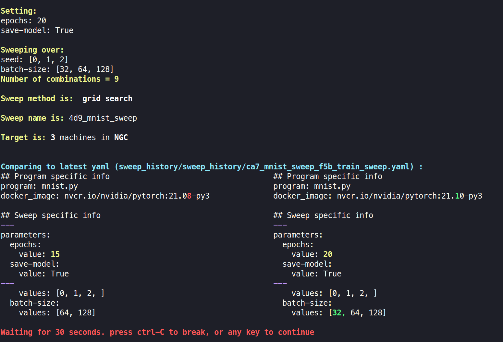

# NGC Sweep Example
A minimal MNIST example to launch a hyper-param sweep on NGC using W&B.

You can use this project as a template when starting a new python project.

Features:
* Sweep over any python script that has a commandline api (e.g with argparse)
* Easy setup: only few edits of a YAML config file, without any code changes.
* Hyper-param sweep is configurable from a yaml file
* Can launch the sweep with a local docker instance instead of NGC (for quick sanity checks of your code)
* Versioning of launched sweeps
  * Disallow launching a sweep for an uncommitted or an unpushed repository
  * Save every launched sweep and commandline to a "sweep_history" folder
  * Adds a unique hash name to your NGC jobs, so you can easily find and kill them using a regex
* Automatic visual diff vs last submitted sweep
* Starts a Jupyter server on every remote machine
* Starts a webhost on every remote machine (accessing /workspace/www)
* Launch a sweep for a historical commit (not just the latest commit) 


## MNIST Example
Instructions for running the MNIST example included in this project. 

### Setup
Download or clone this repo

and then call
```
python -m pip install -r requirements.txt
```


### Sweep
Edit the hyper params in 
```configurations/train_sweep.yaml```

Send the sweep to NGC with:
```
python launch_sweep.py -d=configurations/launch/default.yaml -s=configurations/train_sweep.yaml --num_machines=2 --target=NGC 
```
where:
```
-d                  # path of the launcher config file (yaml)
-s                  # path of the sweep config file (yaml)
--target            # options are NGC|docker
--num_machines      # num machines to use on the NGC cluster (default=1)
--gpu_ram           # override the default gpu ram (16|32) 
--only_committed    # options are True|False (default=True)
```

When launching a sweep, the system first displays a summary of the sweep-job and a visual diff to the last sweep-job that was submitted.
Then it waits up to 30 seconds for the user to approve the job.

You can use the hash code in the sweep name (e.g. `4d9`) to monitor or kill the jobs in this sweep when using `pyngc` project. 

## Custom project configuration
When setting up a new project, you **must** edit the following arguments in `configurations/launch/default.yaml` (only once) 
```
  git: 
    clone_url: <A URL WITH A DEPLOY TOKEN TO CLONE THE REPO>
  ngc:
    workspace: <WORKSPACE NAME ON NGC>
    job_name:  <JOB NAME ACCORDING TO NGC TEMPLATES>
    ngc_instance: <optional, update the compute instance type>

```

in `configurations/train_sweep.yaml` you should edit the global program and sweep info (only once)
```
  program:      <PYTHON SCRIPT NAME>
  docker_image: <DOCKER IMAGE NAME>
  project:      <PROJECT NAME in W&B>
  sweep_name:   <SWEEP BASE NAME IN W&B>
  parameters:   <HYPER-PARAMS RANGES>
```

You can optionally edit the following files:
```
  requirements.txt                  # Python pip requirements. Allowing you to use a vanilla docker image and install the requirements on the fly 
  docker_cfg/ngc_prepare_data.sh    # Commands for copying and extracting your data on NGC  
  docker_cfg/docker_prepare_data.sh # Commands for copying and extracting your data on local docker  
  docker_cfg/configuration.sh       # Initial configuration. E.g. (1) Add a soft link to your data (2) Install apps
  docker_cfg/Dockerfile             # your Dockerfile
```

### Setting the data path names
We recommend that you point to your data path using a soft-link, and add the soft-link name under `.gitignore`. This way you can set the paths according to each machine type (local/NGC/docker). See `mnist_data` in the template example. 


